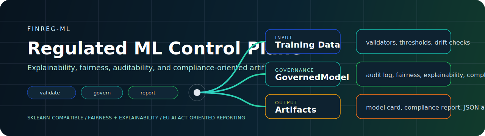
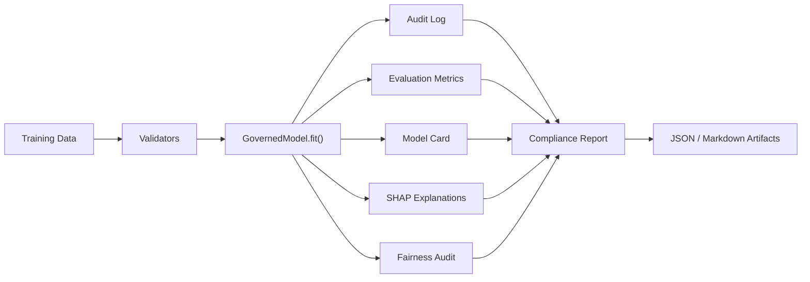

<div align="center">
  
</div>

<div align="center">

[](https://pypi.org/project/finreg-ml/)
[](https://github.com/atharvajoshi01/finreg-ml/actions/workflows/ci.yml)
[](https://python.org)
[](LICENSE)
[](#current-scope)

Train a model. Produce the artifacts compliance teams ask for.

</div>

`finreg-ml` is a regulation-aware wrapper around scikit-learn style models for teams building ML systems in workflows where explainability, fairness, auditability, and documentation are not optional.

It is aimed at high-friction use cases like credit scoring, fraud detection, insurance pricing, and similar decision systems with regulatory or internal governance pressure.

## Why This Exists

Most ML pipelines stop at model metrics.

Real deployment does not.

You still need:

- explanations that can be reviewed
- fairness checks across protected attributes
- model documentation for downstream stakeholders
- audit logs for training and prediction events
- a compliance-oriented summary of what has and has not been generated

`finreg-ml` packages those steps into one developer-facing flow.

## Control Plane

| Layer | What it gives you |
| --- | --- |
| `GovernedModel` | sklearn-compatible wrapper that logs training metadata and keeps governance artifacts attached to the model lifecycle |
| `Explainability` | SHAP-based explanation reports and ranked feature importance |
| `Fairness` | demographic parity, equalized odds, disparate impact ratio, and four-fifths-rule style checks |
| `Compliance` | EU AI Act-oriented pass/fail report for documented controls |
| `Audit` | append-only audit log with SHA-256 integrity checks |
| `Reporting` | JSON and Markdown outputs for model cards, compliance reports, and aggregate reporting |
| `Validation and drift` | training-data validation, threshold tooling, and drift detection utilities |

## Operating Flow



## Quick Start

```python
from finreg import GovernedModel
from sklearn.ensemble import GradientBoostingClassifier

model = GovernedModel(
    estimator=GradientBoostingClassifier(),
    protected_attributes=["age_group", "gender"],
    risk_tier="high",
    model_name="CreditScorer",
    intended_use="Consumer credit approval support",
)

model.fit(X_train, y_train)
metrics = model.evaluate(X_test, y_test)
explanations = model.explain(X_test)
fairness = model.fairness_report(X_eval_with_protected_columns, y_test)
compliance = model.compliance_report(
    has_human_oversight=True,
    has_data_governance=True,
)

model.model_card().to_json("model_card.json")
model.audit_log.to_json("audit_log.json")
compliance.to_json("compliance_report.json")
```

Install:

```bash
pip install finreg-ml
```

## What You Get Back

After a typical run, the repo supports producing artifacts such as:

- `model_card.json`
- `audit_log.json`
- `compliance_report.json`
- explanation summaries from SHAP
- fairness summaries by protected attribute

This is the difference between "the model trained" and "the model can be reviewed."

## Included Example

The repo ships with an end-to-end synthetic credit scoring example:

```bash
python examples/credit_scoring.py
```

That example covers:

- synthetic tabular training data
- protected attributes for fairness review
- sklearn estimator wrapping
- explanations
- fairness auditing
- compliance reporting
- artifact export

## Feature Surface

### EU AI Act-oriented checks

Current compliance logic maps generated artifacts and documented controls to checks related to:

- `Article 10` data governance
- `Article 12` automatic logging
- `Article 13` technical documentation and explainability
- `Article 14` human oversight
- `Article 15` accuracy metrics and bias testing

### Fairness metrics

For each protected attribute, the library can compute:

- demographic parity difference
- equalized odds difference
- disparate impact ratio
- four-fifths-rule style pass/fail signal

### Data quality and drift support

Utilities included in the repo cover:

- training data validation
- threshold optimization helpers
- drift detection with KS and PSI-style checks
- consolidated report generation

## Current Scope

This project is still `alpha`, and the README should be honest about that.

Current constraints:

- focused on scikit-learn compatible classifiers
- optimized for tabular workflows
- compliance output is governance-oriented engineering documentation, not legal advice
- human oversight and data governance inputs still require explicit developer-provided signals

That is deliberate. The repo is trying to make regulated ML easier to operationalize, not pretend compliance can be solved with one function call.

## Development

```bash
git clone https://github.com/atharvajoshi01/finreg-ml.git
cd finreg-ml
python3 -m venv .venv
.venv/bin/pip install -e ".[dev]"
.venv/bin/pytest -q
```

Tests currently cover pipeline behavior, reporting, drift detection, thresholding, and validators.

## License

MIT
